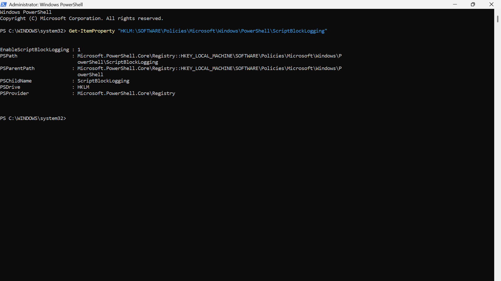
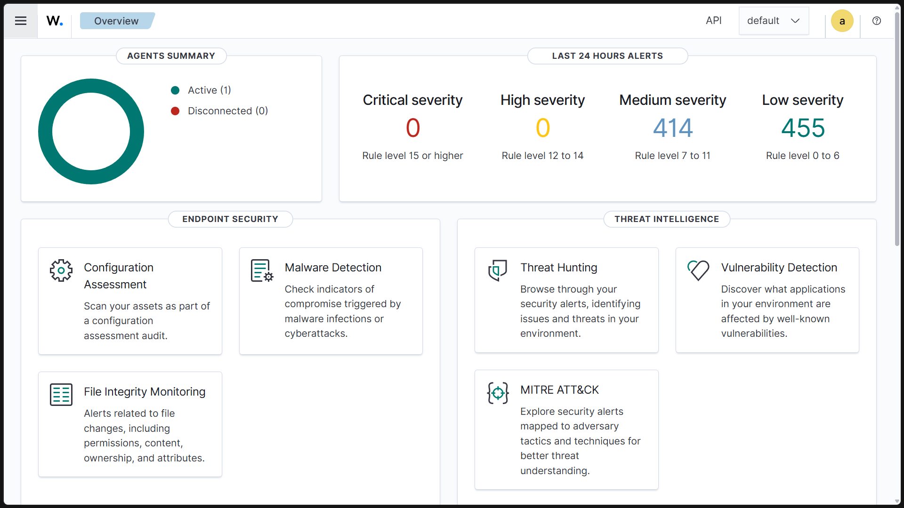
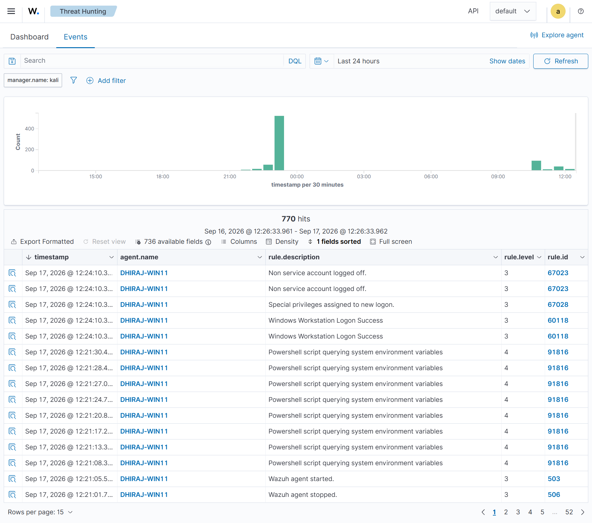
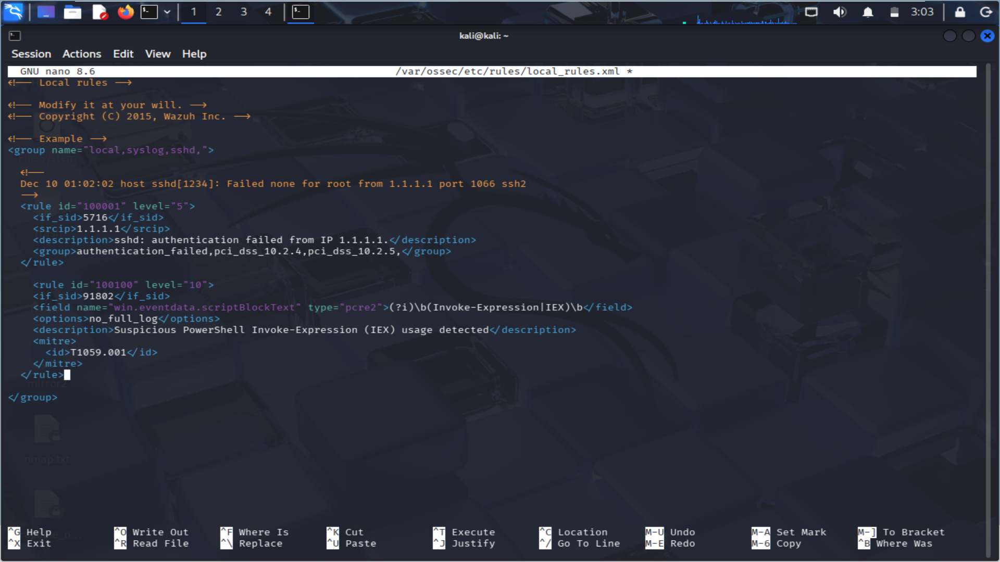
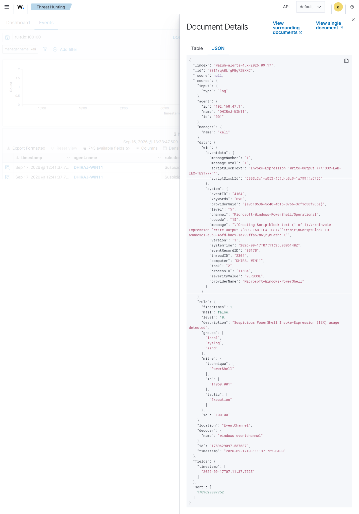

# Wazuh PowerShell Detection Engineering


A hands-on SOC home-lab project demonstrating **Windows PowerShell monitoring, log collection, Wazuh detection engineering, custom alerting, MITRE ATT&CK mapping, and incident investigation**.

The project focuses on detecting suspicious PowerShell `Invoke-Expression (IEX)` usage through Windows PowerShell Script Block Logging and a custom Wazuh rule.

---

## 📌 Project Overview

PowerShell is a legitimate Windows administration and automation framework, but it can also be abused by attackers to execute commands and scripts.

In this project, a **Windows 11 endpoint** was connected to a **locally hosted Wazuh Manager** running inside a Kali Linux virtual machine.

PowerShell Script Block Logging was enabled on the Windows endpoint, and PowerShell Operational events were collected by the Wazuh Agent.

A custom Wazuh detection rule was created to identify PowerShell Script Block content containing:

```text
Invoke-Expression
IEX
```

A controlled PowerShell test was executed to validate the detection.

The resulting Wazuh alert was investigated and mapped to:

> **MITRE ATT&CK T1059.001 — Command and Scripting Interpreter: PowerShell**

This project demonstrates the workflow:

**Endpoint Telemetry → Log Collection → Detection Rule → Alert → Investigation → MITRE Mapping → Incident Documentation**

---

## 🎯 Project Objectives

- Configure Windows PowerShell logging
- Enable PowerShell Script Block Logging
- Connect a Windows endpoint to Wazuh
- Collect PowerShell Operational events
- Analyze PowerShell activity in Wazuh
- Develop a custom Wazuh detection rule
- Detect `Invoke-Expression (IEX)` usage
- Validate the detection with a controlled test
- Map the detection to MITRE ATT&CK
- Investigate the generated security alert
- Document the incident and evidence

---

## 🖥️ Lab Environment

| Component | Configuration |
|---|---|
| Endpoint OS | Windows 11 Pro |
| Endpoint Hostname | `DHIRAJ-WIN11` |
| Wazuh Agent | 4.14.5 |
| Wazuh Manager | 4.x |
| SIEM / Security Platform | Wazuh |
| Virtualization | VMware |
| Wazuh Manager IP | `192.168.47.128` |
| Windows Agent IP | `192.168.47.1` |
| PowerShell Log | `Microsoft-Windows-PowerShell/Operational` |

---

## 🏗️ Lab Architecture

```text
                    SOC HOME LAB

┌──────────────────────────────────────────────┐
│              Windows 11 Endpoint             │
│                                              │
│  Hostname: DHIRAJ-WIN11                     │
│  Wazuh Agent: 4.14.5                         │
│  PowerShell                                   │
│  Script Block Logging                         │
│                                              │
│        PowerShell Activity                   │
└──────────────────────┬───────────────────────┘
                       │
                       │ Windows PowerShell
                       │ Operational Events
                       ▼
┌──────────────────────────────────────────────┐
│              Wazuh Manager                   │
│                                              │
│  Log Collection                              │
│  Rule Processing                             │
│  Custom Detection                            │
│                                              │
│  Custom Rule: 100100                         │
└──────────────────────┬───────────────────────┘
                       │
                       ▼
┌──────────────────────────────────────────────┐
│              Wazuh Dashboard                │
│                                              │
│  Alert Investigation                         │
│  Event Analysis                              │
│  MITRE ATT&CK Mapping                        │
└──────────────────────────────────────────────┘
```

---

## 🔧 1. PowerShell Logging Configuration

### PowerShell Operational Log

The Windows PowerShell Operational event channel was verified before testing.

Command used:

```powershell
Get-WinEvent -ListLog "Microsoft-Windows-PowerShell/Operational" |
Select-Object LogName, IsEnabled
```

The log channel was enabled.

### Enable Script Block Logging

PowerShell Script Block Logging was enabled using the Windows Registry policy:

```powershell
New-Item -Path "HKLM:\SOFTWARE\Policies\Microsoft\Windows\PowerShell\ScriptBlockLogging" -Force | Out-Null

Set-ItemProperty `
-Path "HKLM:\SOFTWARE\Policies\Microsoft\Windows\PowerShell\ScriptBlockLogging" `
-Name EnableScriptBlockLogging `
-Value 1
```

The configuration was verified using:

```powershell
Get-ItemProperty "HKLM:\SOFTWARE\Policies\Microsoft\Windows\PowerShell\ScriptBlockLogging"
```

Expected configuration:

```text
EnableScriptBlockLogging : 1
```

---

## 🔗 2. Wazuh Agent Deployment

The Windows endpoint was connected to the Wazuh Manager running inside the Kali Linux virtual machine.

The Wazuh Agent was configured to communicate with:

```text
Wazuh Manager: 192.168.47.128
```

The agent appeared in the Wazuh Dashboard as:

```text
Agent: DHIRAJ-WIN11
Status: Active
Version: 4.14.5
```

---

## 📡 3. PowerShell Event Collection

The Wazuh Agent was configured to collect the Windows PowerShell Operational event channel.

Configuration added to:

```text
C:\Program Files (x86)\ossec-agent\ossec.conf
```

Configuration:

```xml
<localfile>
  <location>Microsoft-Windows-PowerShell/Operational</location>
  <log_format>eventchannel</log_format>
</localfile>
```

The Wazuh Agent service was restarted after the configuration change.

```powershell
Restart-Service -Name Wazuh
```

---

## 🔍 4. PowerShell Event Validation

A controlled PowerShell command was executed to generate PowerShell activity:

```powershell
Write-Output "SOC-LAB-PowerShell-Test"
```

PowerShell Operational events were generated and collected by Wazuh.

The Wazuh Threat Hunting interface showed PowerShell-related events from the Windows endpoint.

Built-in Wazuh PowerShell detection was also observed during testing, including rule:

```text
Rule ID: 91816
Description: Powershell script querying system environment variables
```

---

## 🛡️ 5. Custom Wazuh Detection Rule

A custom detection rule was created in:

```text
/var/ossec/etc/rules/local_rules.xml
```

The rule uses Wazuh rule `91802` as the parent and examines the PowerShell Script Block content.

### Detection Logic

The rule searches for:

```text
Invoke-Expression
IEX
```

### Custom Rule

```xml
<rule id="100100" level="10">
  <if_sid>91802</if_sid>
  <field name="win.eventdata.scriptBlockText" type="pcre2">(?i)\b(Invoke-Expression|IEX)\b</field>
  <options>no_full_log</options>
  <description>Suspicious PowerShell Invoke-Expression (IEX) usage detected</description>
  <mitre>
    <id>T1059.001</id>
  </mitre>
</rule>
```

### Rule Validation

The Wazuh rule configuration was syntax-checked using:

```bash
sudo /var/ossec/bin/wazuh-analysisd -t
```

The Wazuh Manager was then restarted:

```bash
sudo systemctl restart wazuh-manager
```

---

## 🧪 6. Detection Testing

A controlled PowerShell test was executed on the Windows endpoint:

```powershell
Invoke-Expression 'Write-Output "SOC-LAB-IEX-TEST"'
```

This generated a PowerShell Script Block event.

The resulting Wazuh alert matched the custom detection rule.

### Alert Details

```text
Rule ID: 100100
Level: 10
Event ID: 4104
MITRE ATT&CK: T1059.001
Technique: PowerShell
Tactic: Execution
Agent: DHIRAJ-WIN11
```

The verified alert contained the tested PowerShell Script Block:

```text
Invoke-Expression 'Write-Output "SOC-LAB-IEX-TEST"'
```

---

## 🔎 7. Alert Investigation

The generated alert was investigated in the Wazuh Dashboard.

The investigation confirmed:

- The alert was generated by custom rule `100100`
- The underlying Windows event was Event ID `4104`
- The PowerShell Script Block contained `Invoke-Expression`
- The event originated from the configured Windows endpoint
- The detection was mapped to MITRE ATT&CK `T1059.001`

The test was intentionally generated as part of the SOC home-lab validation.

---

## 🧠 MITRE ATT&CK Mapping

| ATT&CK ID | Technique | Relevance |
|---|---|---|
| T1059.001 | Command and Scripting Interpreter: PowerShell | PowerShell activity was detected through Script Block Logging |

The custom Wazuh rule maps the detection to:

```text
T1059.001
Command and Scripting Interpreter: PowerShell
```

---

## 🚨 Incident Disposition

### Classification

```text
Benign / Authorized Security Testing
```

### Status

```text
Closed
```

### Compromise Assessment

```text
No evidence of compromise observed during the controlled test.
```

### Remediation

```text
No remediation required.
```

The PowerShell command was executed intentionally to validate the detection rule.

No evidence was observed during this test of:

- Malware execution
- Persistence
- Credential theft
- Unauthorized access
- System compromise

---

## 📊 Detection Workflow

```text
Windows PowerShell
       │
       ▼
Script Block Logging
       │
       ▼
PowerShell Event ID 4104
       │
       ▼
Wazuh Agent
       │
       ▼
Wazuh Manager
       │
       ▼
Custom Rule 100100
       │
       ▼
Alert
       │
       ▼
SOC Investigation
       │
       ▼
MITRE ATT&CK T1059.001
       │
       ▼
Incident Documentation
```

---

## 📁 Repository Structure

```text
wazuh-powershell-detection-engineering/
│
├── README.md
│
├── detection-rules/
│   └── local_rules.xml
│
├── incident-report/
│   └── Dhiraj_Antre_Wazuh_PowerShell_Incident_Report.pdf
│
└── evidence/
    ├── 01-powershell-logging-enabled.png
    ├── 02-wazuh-agent-active.png
    ├── 03-powershell-events-in-wazuh.png
    ├── 04-custom-rule-100100.png
    └── 05-custom-alert-json.png
```

---

## 📸 Evidence

### 1. PowerShell Logging Enabled



Shows the Windows PowerShell Operational log and Script Block Logging configuration.

---

### 2. Wazuh Agent Active



Shows the Windows endpoint registered and active in the Wazuh Dashboard.

---

### 3. PowerShell Events in Wazuh



Shows PowerShell-related events collected and analyzed in Wazuh.

---

### 4. Custom Rule 100100



Shows the custom Wazuh detection rule for `Invoke-Expression (IEX)`.

---

### 5. Custom Wazuh Alert



Shows the verified Wazuh alert containing Event ID `4104`, rule `100100`, and the controlled `Invoke-Expression` test.

---

## 🛠️ Technologies Used

- Wazuh
- Windows 11
- PowerShell
- PowerShell Script Block Logging
- Windows Event Logs
- Wazuh Agent
- Wazuh Manager
- Wazuh Dashboard
- VMware
- Kali Linux
- MITRE ATT&CK
- XML
- PCRE2 Regular Expressions

---

## 💡 Skills Demonstrated

- SIEM monitoring
- Windows security event analysis
- PowerShell logging
- Script Block Logging
- Wazuh Agent deployment
- Wazuh log collection
- Wazuh rule creation
- Detection engineering
- Regular expression based detection
- Alert investigation
- MITRE ATT&CK mapping
- Incident classification
- Security documentation
- SOC investigation workflow

---

## 📚 Key Learning Outcomes

This project provided hands-on experience with the complete detection engineering lifecycle:

1. Generating endpoint telemetry
2. Enabling security logging
3. Collecting Windows events
4. Sending telemetry to a SIEM
5. Creating a custom detection rule
6. Testing the detection
7. Investigating the resulting alert
8. Mapping the activity to MITRE ATT&CK
9. Classifying the security event
10. Documenting the investigation

---

## ⚠️ Lab Disclaimer

This project was performed in a controlled personal SOC home-lab environment.

The PowerShell activity used for detection validation was intentionally executed for security testing and detection engineering purposes.

The alert generated during testing was classified as **Benign / Authorized Security Testing**.

No real-world malicious activity or unauthorized access was performed.

---

## 👤 Author

**Dhiraj Antre**

Aspiring SOC Analyst | Cybersecurity Enthusiast

GitHub: [github.com/dhirajantre](https://github.com/dhirajantre)
